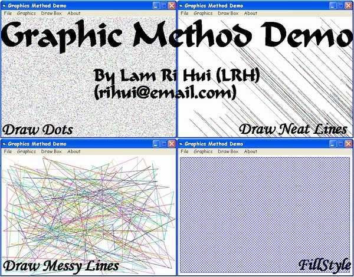



## Graphics Method Demo

### Description

Learn how to (a) Draw dots randomly on form using PSet method (b) Draw lines randomly but neatly on form using Line method (c) Draw messy lines on form using Rnd and Line method (d) Draw FillStyle using FillStyle method. Comments are welcomed. Please vote.
 
### More Info
 

             |
---                |---
**Submitted On**   |2003-10-04 16:28:42
**By**             |[Lam Ri Hui](https://github.com/Planet-Source-Code/PSCIndex/blob/master/ByAuthor/lam-ri-hui.md)
**Level**          |Beginner
**User Rating**    |5.0 (10 globes from 2 users)
**Compatibility**  |VB 3\.0, VB 4\.0 \(16\-bit\), VB 4\.0 \(32\-bit\), VB 5\.0, VB 6\.0
**Category**       |[Graphics](https://github.com/Planet-Source-Code/PSCIndex/blob/master/ByCategory/graphics__1-46.md)
**World**          |[Visual Basic](https://github.com/Planet-Source-Code/PSCIndex/blob/master/ByWorld/visual-basic.md)
**Archive File**   |[Graphics\_M1654501062003\.zip](https://github.com/Planet-Source-Code/lam-ri-hui-graphics-method-demo__1-48888/archive/master.zip)

